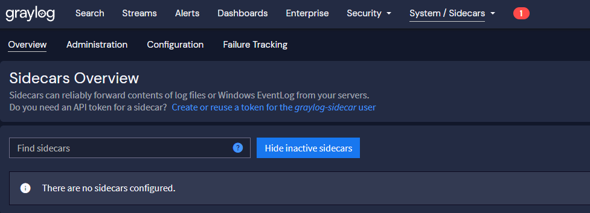

# Windows Sidecar Installation & Configuration Guide

This guide provides step-by-step instructions for deploying the Graylog Windows Sidecar agent using Git and a sparse checkout. This method efficiently downloads only the necessary configuration files for the Windows environment.


## Step 1: Preparation (Graylog Web UI)

1. Go to **System** → **Sidecars**.
2. Click **Create or reuse a token for the graylog-sidecar user**.

3. Enter a descriptive token name, for example `windows-server-token`
4. Change the time to Live
5. Click **Create Token**.
6. **Copy** the token value immediately and store it securely. **Graylog will not show it again**.


## Step 2: Create Sidecar Configuration

1.  In the Graylog web interface, navigate to **System** → **Sidecars**.
2.  Select the **Configuration** tab.
3.  In the configuration form, provide the following details:
    *   **Name:** Enter a descriptive name for the configuration (e.g., `Windows Servers`).
    *   **Tags:** Assign a tag that your Windows hosts will use (e.g., `windows-dc-01`). This tag must match the `GRAYLOG_TAGS` value you will set in the `.env` file later.
    *   **Collector:** From the dropdown, select **Winlogbeat** on Windows.
### Understanding the Winlogbeat Configuration File

```yaml
# ================= Required Metadata Settings =================
fields_under_root: true
fields.collector_node_id: ${sidecar.nodeName}
fields.gl2_source_collector: ${sidecar.nodeId}
fields.gl2_sidecar_collector_type: winlogbeat

# ==================== Network Log Routing ====================
output.logstash:
  hosts: ["172.16.0.115:5044"] 
  worker: 2
  loadbalance: true
  ttl: 120s

# =================== Host Storage Boundaries ===================
path:
  data: "C:\\Program Files\\Graylog\\Sidecar\\cache\\winlogbeat\\data"
  logs: "C:\\Program Files\\Graylog\\Sidecar\\logs"

tags:
  - windows-core

# ================= Windows Event Log Ingestion =================
winlogbeat:
  event_logs:
    - name: Application
      ignore_older: 96h
      
    - name: System
      ignore_older: 96h
      
    - name: Security
      ignore_older: 96h
      # Production Pruning: Drops extremely noisy internal system polling IDs
      event_id: -4662, -5156, -5158 
      
    - name: Setup
      ignore_older: 96h
      
    - name: ForwardedEvents
      forwarded: true
      ignore_older: 96h
      
    - name: Microsoft-Windows-Windows Defender/Operational
      ignore_older: 96h
      
    - name: Microsoft-Windows-Sysmon/Operational
      ignore_older: 96h
      
    - name: Microsoft-Windows-TerminalServices-LocalSessionManager/Operational
      ignore_older: 96h
      
    - name: Microsoft-Windows-PowerShell/Operational
      ignore_older: 96h
      
    - name: Windows PowerShell 
      ignore_older: 96h

# ================= Performance Pipeline Buffering =================
queue.mem:
  events: 4096
  flush.min_events: 512
  flush.timeout: 5s

```

### Deep Dive: Understanding What This File Does

This file acts as a centralized template managed purely in the Graylog Web UI. When a Windows machine checks in with a matching tag, the Sidecar automatically converts this template into a physical file on the host's drive and restarts Winlogbeat to apply it.

* **Dynamic Ingestion Variables:** Variables formatted like `${sidecar.nodeName}` are dynamically compiled by Graylog upon delivery. This guarantees that individual Windows nodes identify themselves by their real-time server hostname without you having to write independent files for each machine.
* **Network Target Routing (`output.logstash`):** This maps where Winlogbeat will stream the collected data. It targets a centralized Graylog Beats input (running on port 5044) using a multi-worker, load-balanced configuration to handle high volumes of enterprise event data safely.
* **Noise Pruning & Data Integrity:** It monitors core OS logs alongside advanced auditing frameworks (Sysmon, PowerShell execution, and Windows Defender). It uses `ignore_older: 96h` to prevent the agent from overloading your network by historical back-filling on setup, and leverages negative event operators (`event_id: -4662`) to filter out noisy active-directory polling loops before they hit your network storage.
* **Failover Buffer (`queue.mem`):** Allocates a dedicated local memory buffer. If network issues occur or the Graylog instance updates, Winlogbeat securely queues up to 4,096 log changes in system RAM, dumping them straight to Graylog the second the endpoint reconnects.

---

### How to Customize This File for Your Infrastructure

You can adapt this baseline layout to your organization's internal compliance rules by tweaking a few key parameters:

#### 1. Change the Target Graylog Server IP

Locate the `output.logstash` section and replace the placeholder IP address with the actual network location of your Graylog Beats input:

```yaml
output.logstash:
  hosts: ["YOUR_GRAYLOG_SERVER_IP:5044"]
```

#### 2. Fine-Tune Historical Boundaries

If you only want logs generated within the last 24 or 48 hours to ingest when a host is spun up, lower the time index constraints:

```yaml
ignore_older: 48h  # Adjust from 96h to meet storage retention preferences
```

#### 3. Ignore or Whitelist Specific Event IDs

The config uses a minus sign (`-`) to tell the parser to drop specific IDs.

* **To block more noise:** Add a comma and the ID number (e.g., `-5156, -5158, -4624`).
* **To fetch *only* explicit IDs:** Remove the minus sign entirely and define them directly (e.g., `event_id: 4624, 4625` to track ONLY successes and failures).

```yaml
    - name: Security
      ignore_older: 46h
      event_id: 4624, 4625 # Tracks only Successful and Failed logon events
```

#### 4. Pull Custom Application Logs

If your servers utilize specific applications that dump directly into custom event channels (such as specialized SQL or IIS logging frameworks), append them to the list using their exact Windows Event channel name:

```yaml
    - name: Microsoft-Windows-TaskScheduler/Operational
      ignore_older: 96h
```


> 📘 **Official Documentation**
> For more information regarding advanced routing options, custom variable injection, and scaling thresholds, see the official [Graylog Sidecar Documentation](https://go2docs.graylog.org/current/getting_in_log_data/graylog_sidecar.html).
4. Click **Create Configuration**.
5. Add a winlogbeat configuration (see below) 
## Step 3: Download Configuration Files

First, open **Windows PowerShell with administrative privileges**.

Once the administrative PowerShell terminal is open, navigate to the directory where you want to store the configuration files. **NOTE:** Storing in C:\Program Files might cause problems later.

Next, execute the following commands to clone the repository and retrieve the Windows-specific files:

```bash
# Clone the repository structure without pulling down raw files
git clone --filter=blob:none --no-checkout https://github.com/Industry-Project-VTSSN/Central-logging-graylog.git

# Move into the newly created project folder
cd Central-logging-graylog

# Initialize the sparse-checkout system in 'cone' mode for maximum performance
git sparse-checkout init --cone

# Explicitly declare the directory you want to pull down
git sparse-checkout set windows

# Force Git to check out the matching files to your disk
git checkout

# Navigate directly into your active deployment environment
cd windows
```

## Step 4: Configure Environment Variables

Next, you will create and configure the environment file for the Sidecar. This file tells the agent how to communicate with your Graylog server.

1.  **Create the environment file:**

    In your PowerShell terminal (still inside the `windows` directory), copy the example environment file to a new file named `.env`:

    ```powershell
    cp env.example .env
    ```

2.  **Edit the environment file:**

    Open the newly created `.env` file in Notepad to edit its contents. You can do this directly from your terminal:

    ```powershell
    notepad .env
    ```

3.  **Update the configuration values:**

    In the Notepad window that opens, you will see several configuration variables. You must update the following values to match your Graylog server setup:

    *   `GRAYLOG_SERVER_URL`: Change `http://127.0.0.1:9000/api/` to the actual URL of your Graylog server's API endpoint.
    *   `GRAYLOG_API_TOKEN`: Replace `your_secret_api_token_here` with a valid API token from your Graylog server.
    *   `GRAYLOG_TAGS`: Change `default` to the specific tag you have configured for this Sidecar in your Graylog instance (e.g., `windows-core`).

    After editing, save the file and close Notepad.

## Step 5: Install the Sidecar Service

Finally, with the configuration in place, run the installation script from your PowerShell terminal. This will install and start the Graylog Sidecar as a Windows service.

```powershell
.\Install-GraylogSidecar.ps1
```
If the install script returns the following output the installation has completed successfully and your sidecar is running! **NOTE:** `GRAYLOG01-O-ICT` is the hostname of the machine. The install script automatically sets it as nodename. 
```bash
=======================================================
 AUTOMATED DEPLOYMENT SUCCESSFUL ON: GRAYLOG01-O-ICT
=======================================================

Status   Name               DisplayName
------   ----               -----------
Running  graylog-sidecar    Graylog Sidecar
```


## Step 6: Verify Sidecar Operation

After the installation is complete, you can verify that the Sidecar is running and communicating with Graylog.

1.  In the Graylog web interface, navigate back to **System** → **Sidecars**.
2.  Under the **Overview** tab, you should see your new Windows Sidecar listed.
3.  To confirm that logs are being received, find your sidecar in the list and click the **Show messages** button for that sidecar.

If everything is configured correctly, you will see the log messages from your Windows machine appearing in Graylog.


##  Next Steps & Day-to-Day Operations

Now that your Windows Sidecar is successfully installed, you may need to modify its behavior in the future (such as adding new event logs, changing server URLs, or updating environment tags).

For detailed instructions on managing your Sidecars post-deployment, please refer to the [Graylog Sidecar Operations & Maintenance Guide](windows_sidecar_maintenance.md).